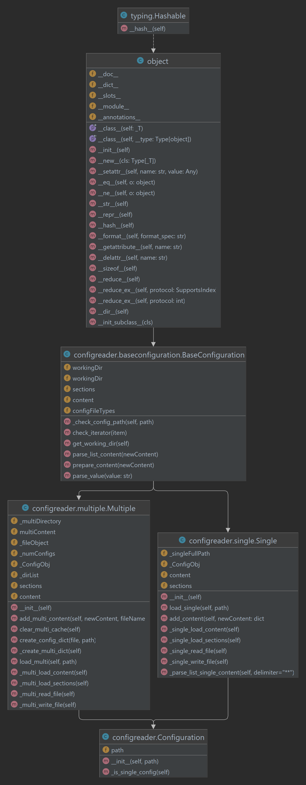

# Configuration Reader Library
#### The Configuration Reader library is a Python utility to manage, read, and write configuration files. This library can handle both single configuration files and multiple configurations from a directory.
## Table of Contents
* Installation
* Usage
* Basic Usage
* Working with Single Configuration Files
* Working with Multiple Configuration Files
* API Reference
* Sample Configuration File
## Installation
bash

    pip install -r requirements.txt
## Usage
#### Example config.ini file:
    [project_directory]
    sub_dirs = **dataset,model,plots,summary,results
    
    [Plotting]
    plot_window_x_size = 10
    plot_window_y_size = 5
    log_scale = bool:True
    hue = None
    
    [DataExtraction]
    pump_down_upper_limit = int:998
    pump_down_lower_limit = float:5.0e-5
#
### Single Configuration:
#### Load and use of single config file:
    # Load a single config file
    config = Configuration("path/to/config.ini")
    
    # Check if a setting is True or False
    if config.conent["Plotting"]["log_scale"]:
        print("Logarithmic scaling being used")
#### Adding new content to Single Configuration File:
    from configurationreader import Configuration
    
    # Load a single configuration file
    config = Configuration("path/to/config.ini")
    
    # Add new content
    new_content = {
        "section_name": {
            "key1": "value1",
            "key2": "value2"
        }
    }

    config.add_content(new_content)

### Config.ini after adding:

    [project_directory]
    sub_dirs = **dataset,model,plots,summary,results
    
    [Plotting]
    plot_window_x_size = 10
    plot_window_y_size = 5
    log_scale = bool:True
    hue = None
    
    [DataExtraction]
    pump_down_upper_limit = int:998
    pump_down_lower_limit = float:5.0e-5

    [section_name]
    key1 = value1
    key2 = value2
#
## Multiple Configuration Use:
#### Load all configuration files from a directory
    config.load_multi("path/to/directory_with_configs")

    # Add new content to a specific configuration file
    new_content = {
        "section_name": {
            "key1": "value1",
            "key2": "value2"
        }
    }
    config.add_multi_content(new_content, "specific_config_file_name_without_extension")
# API Reference
The Configuration Reader library consists of the main Configuration class and auxiliary classes Single and Multiple 
that manage individual configuration files and directories of configuration files, respectively. The shared methods 
and attributes between these classes are managed in the BaseConfiguration class.

### Configuration.py
* Inherited classes: 
  * Single, Multiple
* Attributes:
  * path: string
* Methods
  * __init__(self, path)
    * Constructor. Initialize the Configuration class. Load either a single configuration file or 
    a directory of configuration files depending on the path provided.
  * _is_single_config(self)
    * Determines if the path is a single configuration file.

### BaseConfiguration.py
* Attributes:
  * workingDir: Current working directory. 
  * sections: List of sections. 
  * content: Content as a dictionary. 
  * configFileTypes: Types of config files accepted (like "ini", "cnf", "conf").
* Methods:
  * _check_config_path(self, path)
    * Check for config file in the given path. 
  * check_iterator(item)
    * Check if an object is iterable. 
  * get_working_dir(self)
    * Fetch the current working directory. 
  * parse_list_content(newContent)
    * Parse loaded content into a list starting with '**'. 
  * prepare_content(newContent)
    * Parse key from a dictionary to set section name of a config.ini file. 
  * parse_value(value)
    * Parse a value based on type annotations.

### Single.py
* Inherited classes:
  * BaseConfiguration
* Attributes:
  * _singleFullPath: Full path of the single configuration file.
  * _ConfigObj: ConfigParser object. 
  * content: Content as a dictionary. 
  * sections: List of sections.
* Methods:
  * __init__(self)
    * Constructor for the Single class. 
  * load_single(self, path)
    * Load content from a single configuration file. 
  * add_content(self, newContent)
    * Adds new sections & content to _ConfigObj.
  * _single_load_content(self)
    * Load content from the config file & return a dictionary.
  * _single_load_sections(self)
    * Load all sections of the ini file into the sections list.
  * _single_read_file(self)
    * Read content from the given file path.
  * _single_write_file(self)
    * Write the _ConfigObj to the class's INI file.
  * _parse_list_single_content(self, delimiter)
    * Parse content from a single file into a list type.

### Multiple
* Inherited classes:
  * BaseConfiguration
* Attributes:
  * _multiDirectory: Directory path containing multiple configuration files. 
  * multiContent: Content as a dictionary.
  * _fileObject: File object.
  * _numConfigs: Number of configurations.
  * _ConfigObj: ConfigParser object.
  * _dirList: List of directories. 
  * sections: List of sections. 
  * content: Content as a dictionary.
* Methods:
  * __init__(self): Constructor for the Multiple class. 
  * add_multi_content(self, newContent, fileName)
    * Adds new sections & content to _ConfigObj. 
  * clear_multi_cache(self)
    * Clear & reset the cache for the next configuration file to be loaded. 
  * create_config_dict(file, path)
    * Create a structure of file information.
  * _create_multi_dict(self)
    * Check if the path contains configuration files. 
  * load_multi(self, path)
    * Load multiple configuration files from a directory.
  * _multi_load_content(self)
    * Load content from the config file & return a dictionary.
  * _multi_load_sections(self)
    * Load all sections of the ini file into the sections list.
  * _multi_read_file(self)
    * Read content from the given file path.
  * _multi_write_file(self)
    * Write the _ConfigObj to the class's INI file.
